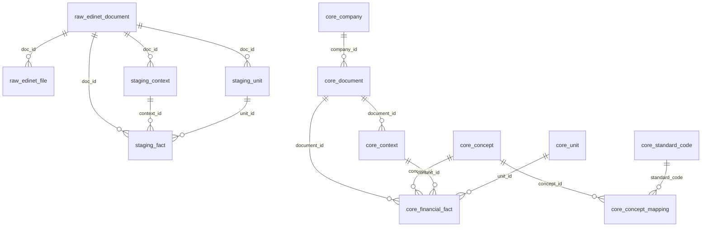

# EDINET 有報取得〜整形〜取込 基盤 仕様書（骨子）

## 1. 概要
EDINET API v2 から有価証券報告書（以下、有報）を取得し、XBRL/iXBRL を解析・正規化して PostgreSQL に格納するまでの一連のデータ基盤仕様（取得/整形/取込）を定義する。  
レポートや分析機能は本仕様の範囲外とし、後続フェーズで設計する。

## 2. スコープ
### 対象
- 有価証券報告書のみ（訂正有報は optional。必要なら含める）
- 全上場企業を対象
- 連結・単体の両方を区分して保持
- 会計基準は日本基準を優先、IFRSのみの企業はIFRSで取り込み
- 金額は円で統一（レポート側で単位変換）

### 非対象
- 四半期報告書、臨時報告書、有価証券届出書
- BI / 可視化 / レポート機能
- 高度な注記解析

## 3. テスト運用方針
### 3.1 初期トライアル
- 期間: 2〜3年分を初期トライアルとして実行
- 対象企業: 上場大手 10〜20社（変更可）

### 3.2 本番運用
- 期間: 5年分（必要に応じ 10 年まで拡張可能）
- 対象企業: 全上場企業

### 3.3 テスト企業候補（変更前提・要確認）
|#|証券コード|企業名（候補）|メモ|
|---|---|---|---|
|1|7203|トヨタ自動車|大規模・連結あり|
|2|6758|ソニーグループ|IFRS可能性|
|3|8306|三菱UFJフィナンシャル・グループ|金融|
|4|9984|ソフトバンクグループ|IFRS可能性|
|5|6861|キーエンス|高収益|
|6|9432|NTT|大型|
|7|9433|KDDI|通信|
|8|6098|リクルートホールディングス|IFRS可能性|
|9|7267|ホンダ|製造|
|10|7974|任天堂|海外比率高|
|11|9983|ファーストリテイリング|IFRS可能性|
|12|6501|日立製作所|多角|
|13|8316|三井住友フィナンシャルグループ|金融|
|14|8035|東京エレクトロン|半導体|
|15|6902|デンソー|製造|

## 4. 前提条件・技術選定
- 言語: Python 3.11+（予定）
- 解析: Arelle（XBRL/iXBRLパース）
- DB: PostgreSQL 15+
- Raw保存: ファイル保存（ZIP/JSON/展開ファイル）
- OS: macOS（開発） / Linux（運用想定）

## 5. データ取得仕様
### 5.1 EDINET API v2
- 書類一覧: `/api/v2/documents.json`
- 書類取得: `/api/v2/documents/{docID}`
- 取得形式: type=1（XBRL ZIP）

### 5.2 フィルタ条件（有報）
- `docTypeCode == 120`（訂正を含む場合は 130 を追加）
- `ordinanceCode == 010`
- `formCode IN ("030000", "030001")`

### 5.3 取得方式
- **初回一括**: 指定年数分を日付レンジで取得
- **日次増分**: 前回取得日からの差分を取得
- **リトライ**: 指数バックオフ + ジッター
- **レート制御**: 1〜3秒間隔（API負荷を抑制）

## 6. Rawファイル保存設計
### 6.1 ディレクトリ構成（案）
```
data/
  raw/
    edinet/
      YYYY/
        MM/
          DD/
            {docID}_{secCode}_{companySlug}/
              doclist.json
              document.zip
              extracted/
                XBRL/
                iXBRL/
              meta.json
```

### 6.2 会社識別情報
- `secCode` と `companySlug` をフォルダ名に含めて可視性を高める  
  例: `E12345_7203_toyota-motor`
- `meta.json` に以下を保存
  - docID
  - EDINETコード
  - 証券コード
  - 会社名
  - 提出日
  - 会計基準
  - 連結/単体識別

## 7. 解析・正規化仕様
### 7.1 XBRL解析
- Arelleで `facts`, `contexts`, `units` を抽出
- `context` から期間、連結/単体を判定

### 7.2 正規化ルール（基本）
- 金額は円で統一（decimals と unit を参照）
- 連結/単体をフラグで保持
- 会計基準を保持し、JGAAP優先・IFRSはフォールバック
- 主要勘定科目はタクソノミ名称を基準化（マッピング表で吸収）

## 8. DB設計（論理構成）
### 8.1 スキーマ構成
- `raw`: ファイル保存のメタ情報、doclist 管理
- `staging`: 正規化途中の fact/context/unit
- `core`: 正式な企業/書類/財務fact

### 8.2 エンティティ定義（DDL同期）
この章は `doc_research/edinet_ddl_draft.sql` と同期する。  
DDLの変更時は、本仕様（エンティティ定義・制約・補足）も同時に更新する。

#### raw.edinet_document
**論理名**: EDINET書類メタ  
**定義/目的**: EDINET書類メタ情報と rawファイル保存先の管理。  
**主なカラム**:
- `id` BIGSERIAL PK
- `doc_id` VARCHAR(20) NOT NULL UNIQUE
- `edinet_code` VARCHAR(10)
- `sec_code` VARCHAR(10)
- `jcn` VARCHAR(13)
- `company_name` TEXT
- `fund_code` VARCHAR(10)
- `submission_date` DATE NOT NULL
- `ope_date_time` TIMESTAMPTZ
- `doc_type_code` VARCHAR(10)
- `ordinance_code` VARCHAR(10)
- `form_code` VARCHAR(10)
- `doc_description` TEXT
- `issuer_edinet_code` VARCHAR(10)
- `subject_edinet_code` VARCHAR(10)
- `subsidiary_edinet_code` VARCHAR(10)
- `period_start` DATE
- `period_end` DATE
- `fiscal_year` SMALLINT
- `accounting_standard` VARCHAR(10)
- `is_consolidated` BOOLEAN
- `is_amended` BOOLEAN DEFAULT FALSE
- `parent_doc_id` VARCHAR(20)
- `withdrawal_status` SMALLINT
- `doc_info_edit_status` SMALLINT
- `disclosure_status` SMALLINT
- `xbrl_flag` SMALLINT
- `pdf_flag` SMALLINT
- `attach_doc_flag` SMALLINT
- `english_doc_flag` SMALLINT
- `csv_flag` SMALLINT
- `legal_status` SMALLINT
- `api_version` VARCHAR(10) DEFAULT 'v2'
- `doclist_json_path` TEXT
- `zip_path` TEXT
- `extracted_path` TEXT
- `fetch_status` VARCHAR(20) DEFAULT 'fetched'
- `fetched_at` TIMESTAMPTZ DEFAULT NOW()
- `parsed_at` TIMESTAMPTZ
- `loaded_at` TIMESTAMPTZ
**制約/キー**:
- PK: `id`
- UNIQUE: `doc_id`
-- パーティション: なし（当面）
**補足**:
- 生データの保存先と処理ステータスを保持
- `subsidiary_edinet_code` は複数値がカンマ連結されるため TEXT で保持

#### raw.edinet_file
**論理名**: EDINET書類ファイル管理  
**定義/目的**: docID配下の raw ファイルを管理（JSON/ZIP/展開物）。  
**主なカラム**:
- `id` BIGSERIAL PK
- `doc_id` VARCHAR(20) NOT NULL（FK: raw.edinet_document.doc_id）
- `file_type` VARCHAR(30) NOT NULL
- `path` TEXT NOT NULL
- `size_bytes` BIGINT
- `sha256` CHAR(64)
- `created_at` TIMESTAMPTZ DEFAULT NOW()
**制約/キー**:
- PK: `id`
- UNIQUE: (`doc_id`, `file_type`, `path`)
- FK: `doc_id` → raw.edinet_document
**補足**:
- `file_type` は `doclist/json/zip/xbrl/ixbrl` などを想定

#### staging.context
**論理名**: XBRLコンテキスト（中間）  
**定義/目的**: XBRL の context 情報（期間・連結・次元）を一時保持。  
**主なカラム**:
- `id` BIGSERIAL PK
- `doc_id` VARCHAR(20) NOT NULL（FK: raw.edinet_document.doc_id）
- `context_ref` TEXT NOT NULL
- `period_type` VARCHAR(20)
- `period_start` DATE
- `period_end` DATE
- `instant_date` DATE
- `entity_identifier` TEXT
- `is_consolidated` BOOLEAN
- `dimensions` JSONB
- `context_hash` CHAR(64)
**制約/キー**:
- PK: `id`
- UNIQUE: (`doc_id`, `context_ref`)
- FK: `doc_id` → raw.edinet_document
**補足**:
- `context_hash` は正規化したcontext情報のハッシュ

#### staging.unit
**論理名**: XBRL単位（中間）  
**定義/目的**: XBRL の unit 情報を一時保持。  
**主なカラム**:
- `id` BIGSERIAL PK
- `doc_id` VARCHAR(20) NOT NULL（FK: raw.edinet_document.doc_id）
- `unit_ref` TEXT NOT NULL
- `measures` JSONB
- `unit_hash` CHAR(64)
**制約/キー**:
- PK: `id`
- UNIQUE: (`doc_id`, `unit_ref`)
- FK: `doc_id` → raw.edinet_document
**補足**:
- `unit_hash` は正規化したunitのハッシュ

#### staging.fact
**論理名**: XBRLファクト（中間）  
**定義/目的**: fact（数値/文字列）を正規化前に保持。  
**主なカラム**:
- `id` BIGSERIAL PK
- `doc_id` VARCHAR(20) NOT NULL（FK: raw.edinet_document.doc_id）
- `concept_qname` TEXT NOT NULL
- `concept_namespace` TEXT
- `concept_name` TEXT
- `context_id` BIGINT（FK: staging.context.id）
- `unit_id` BIGINT（FK: staging.unit.id）
- `value_numeric` NUMERIC(30, 6)
- `value_text` TEXT
- `decimals` SMALLINT
- `is_nil` BOOLEAN DEFAULT FALSE
- `fact_hash` CHAR(64) NOT NULL
- `created_at` TIMESTAMPTZ DEFAULT NOW()
**制約/キー**:
- PK: `id`
- UNIQUE: (`doc_id`, `fact_hash`)
- FK: `doc_id` → raw.edinet_document, `context_id` → staging.context, `unit_id` → staging.unit
**補足**:
- `fact_hash` は concept/context/unit を正規化して生成

#### core.company
**論理名**: 企業マスタ  
**定義/目的**: 企業マスタ。  
**主なカラム**:
- `company_id` BIGSERIAL PK
- `edinet_code` VARCHAR(10) UNIQUE
- `sec_code` VARCHAR(10)
- `jcn` VARCHAR(13)
- `company_name` TEXT NOT NULL
- `industry_code` VARCHAR(10)
- `is_listed` BOOLEAN DEFAULT TRUE
- `is_active` BOOLEAN DEFAULT TRUE
- `created_at` TIMESTAMPTZ DEFAULT NOW()
- `updated_at` TIMESTAMPTZ DEFAULT NOW()
**制約/キー**:
- PK: `company_id`
- UNIQUE: `edinet_code`
**補足**:
- `sec_code` は上場コード。将来の社名変更に備え `is_active` を保持
- 企業同一性の主キーは **JCN（法人番号）を優先**

#### core.document
**論理名**: 書類マスタ（有報）  
**定義/目的**: 有報単位の書類マスタ。  
**主なカラム**:
- `document_id` BIGSERIAL PK
- `doc_id` VARCHAR(20) NOT NULL UNIQUE
- `company_id` BIGINT NOT NULL（FK: core.company.company_id）
- `doc_type_code` VARCHAR(10)
- `submission_date` DATE NOT NULL
- `period_start` DATE
- `period_end` DATE NOT NULL
- `fiscal_year` SMALLINT
- `accounting_standard` VARCHAR(10)
- `is_consolidated` BOOLEAN
- `is_amended` BOOLEAN DEFAULT FALSE
- `parent_doc_id` VARCHAR(20)
- `source_doc_id` VARCHAR(20)
- `created_at` TIMESTAMPTZ DEFAULT NOW()
**制約/キー**:
- PK: `document_id`
- UNIQUE: `doc_id`
- FK: `company_id` → core.company
- パーティション: なし（当面）
**補足**:
- `parent_doc_id` は訂正有報の元、`source_doc_id` は取り込み元識別用途
- `is_consolidated` は文書単位では判定しないため **NULL保持**

#### core.concept
**論理名**: 勘定科目マスタ（タクソノミ）  
**定義/目的**: タクソノミ要素（勘定科目）マスタ。  
**主なカラム**:
- `concept_id` BIGSERIAL PK
- `namespace` VARCHAR(120) NOT NULL
- `element_name` VARCHAR(200) NOT NULL
- `label_ja` TEXT
- `label_en` TEXT
- `data_type` VARCHAR(50)
- `period_type` VARCHAR(20)
- `balance_type` VARCHAR(10)
- `is_standard` BOOLEAN DEFAULT TRUE
**制約/キー**:
- PK: `concept_id`
- UNIQUE: (`namespace`, `element_name`)
**補足**:
- 拡張タクソノミは `is_standard = false` で識別

#### core.standard_code
**論理名**: 標準勘定科目コード  
**定義/目的**: 分析用の共通コード（STD_XXX）の定義マスタ。  
**主なカラム**:
- `standard_code` VARCHAR(50) PK
- `name_ja` TEXT NOT NULL
- `name_en` TEXT
- `category` VARCHAR(20)
- `period_type` VARCHAR(20)
- `description` TEXT
- `is_active` BOOLEAN DEFAULT TRUE
**制約/キー**:
- PK: `standard_code`
**補足**:
- 最小セットから開始し、段階的に拡張する

#### core.concept_mapping
**論理名**: 勘定科目マッピング  
**定義/目的**: タクソノミ要素を標準勘定科目に紐付ける対応表。  
**主なカラム**:
- `mapping_id` BIGSERIAL PK
- `concept_id` BIGINT NOT NULL（FK: core.concept.concept_id）
- `standard_code` VARCHAR(50)（FK: core.standard_code.standard_code）
- `mapping_method` VARCHAR(20)
- `confidence` NUMERIC(5,2)
- `is_active` BOOLEAN DEFAULT TRUE
- `notes` TEXT
- `mapped_by` TEXT
- `mapped_at` TIMESTAMPTZ
**制約/キー**:
- PK: `mapping_id`
- UNIQUE: (`concept_id`, `standard_code`, `mapping_method`)
**補足**:
- 未マッピングは **NULL扱い**とし、分析側で「未分類」と表示する

#### core.context
**論理名**: コンテキストマスタ  
**定義/目的**: context を正規化して保持（document単位）。  
**主なカラム**:
- `context_id` BIGSERIAL PK
- `document_id` BIGINT NOT NULL（FK: core.document.document_id）
- `context_key` TEXT NOT NULL
- `period_type` VARCHAR(20)
- `period_start` DATE
- `period_end` DATE
- `instant_date` DATE
- `entity_identifier` TEXT
- `is_consolidated` BOOLEAN
- `dimensions` JSONB
**制約/キー**:
- PK: `context_id`
- UNIQUE: (`document_id`, `context_key`)
- FK: `document_id` → core.document
**補足**:
- `context_key` は period/dimensions を正規化したキー

#### core.unit
**論理名**: 単位マスタ  
**定義/目的**: 単位マスタ（正規化済み）。  
**主なカラム**:
- `unit_id` BIGSERIAL PK
- `unit_key` TEXT NOT NULL
- `measures` JSONB
**制約/キー**:
- PK: `unit_id`
- UNIQUE: `unit_key`
**補足**:
- 金額は円で統一するため `unit_key = 'JPY'` が基本

#### core.financial_fact
**論理名**: 財務ファクト  
**定義/目的**: 正式な財務ファクト（分析の基盤）。  
**主なカラム**:
- `fact_id` BIGSERIAL PK
- `document_id` BIGINT NOT NULL（FK: core.document.document_id）
- `company_id` BIGINT NOT NULL（FK: core.company.company_id）
- `concept_id` BIGINT NOT NULL（FK: core.concept.concept_id）
- `context_id` BIGINT NOT NULL（FK: core.context.context_id）
- `unit_id` BIGINT（FK: core.unit.unit_id）
- `value_numeric` NUMERIC(30, 6)
- `value_text` TEXT
- `decimals` SMALLINT
- `is_nil` BOOLEAN DEFAULT FALSE
- `fact_hash` CHAR(64) NOT NULL
- `period_end` DATE NOT NULL
- `is_consolidated` BOOLEAN
- `accounting_standard` VARCHAR(10)
- `created_at` TIMESTAMPTZ DEFAULT NOW()
**制約/キー**:
- PK: `fact_id`
- UNIQUE: (`document_id`, `fact_hash`)
- FK: document/company/concept/context/unit 各マスタ参照
- パーティション: なし（当面）
**補足**:
- `fact_hash` は重複排除・UPSERTキーに使用

### 8.3 パーティション方針
- **当面は全テーブルでパーティション無し**（`doc_id` の一意性とFK整合性を優先）
- データ量が増えた段階で、PK/FK設計を見直したうえで導入する

### 8.4 一意性・UPSERT方針
- staging/core では `fact_hash` を使い冪等にUPSERT
- 訂正有報は `parent_doc_id` を参照し既存データを置換

### 8.5 エンティティ間リレーション概要
- `raw.edinet_document` 1 - N `raw.edinet_file`（docID単位で複数ファイル）
- `raw.edinet_document` 1 - N `staging.context` / `staging.unit` / `staging.fact`
- `staging.context` 1 - N `staging.fact`
- `staging.unit` 1 - N `staging.fact`
- `core.company` 1 - N `core.document`
- `core.document` 1 - N `core.context`
- `core.document` 1 - N `core.financial_fact`
- `core.concept` 1 - N `core.financial_fact`
- `core.concept` 1 - N `core.concept_mapping`
- `core.standard_code` 1 - N `core.concept_mapping`
- `core.context` 1 - N `core.financial_fact`
- `core.unit` 1 - N `core.financial_fact`

### 8.6 登録タイミングと処理概要（データ登録の流れ）
- **取得開始（doclist取得）**: `raw.edinet_document` に docID/提出日/会社情報を登録。`raw.edinet_file` に doclist JSON を登録。
- **書類取得（ZIPダウンロード）**: `raw.edinet_file` に ZIP のパス/サイズ/ハッシュを登録。
- **展開・解析（XBRL/iXBRL）**: `staging.context` / `staging.unit` / `staging.fact` を登録。
- **正規化・整形**:
  - `core.company` を upsert（edinet_code をキーに更新/追加）
  - `core.document` を upsert（doc_id をキーに更新/追加）
  - `core.concept` を upsert（namespace + element_name）
  - `core.context` を upsert（document_id + context_key）
  - `core.unit` を upsert（unit_key）
- **本取込（確定）**: `core.financial_fact` を upsert（document_id + fact_hash）
- **訂正有報**: `core.document.is_amended = true` を付与し、`parent_doc_id` の対象データを置換

### 8.7 論理名一覧（物理→論理）
|物理名|論理名|主用途|
|---|---|---|
|raw.edinet_document|EDINET書類メタ|書類単位のメタ・raw保存先|
|raw.edinet_file|EDINET書類ファイル管理|rawファイルの管理|
|staging.context|XBRLコンテキスト（中間）|解析中のcontext保持|
|staging.unit|XBRL単位（中間）|解析中のunit保持|
|staging.fact|XBRLファクト（中間）|解析中のfact保持|
|core.company|企業マスタ|企業属性の正規化|
|core.document|書類マスタ（有報）|有報単位の管理|
|core.concept|勘定科目マスタ（タクソノミ）|タクソノミ要素管理|
|core.standard_code|標準勘定科目コード|共通コード定義|
|core.concept_mapping|勘定科目マッピング|標準コードとの対応付け|
|core.context|コンテキストマスタ|正規化context|
|core.unit|単位マスタ|単位の正規化|
|core.financial_fact|財務ファクト|最終ファクト保存|

### 8.8 ER関係図（Mermaid）


**補足**:
- `raw_edinet_document` は raw の起点で、docID単位で raw ファイルと staging データがぶら下がる
- `core_document` は core の起点で、company と fact 群をつなぐハブ

### 8.9 属性辞書（物理名→論理名）
#### raw.edinet_document
|物理名|論理名|
|---|---|
|id|EDINET書類メタID|
|doc_id|書類ID|
|edinet_code|EDINETコード|
|sec_code|証券コード|
|jcn|法人番号|
|company_name|会社名|
|fund_code|ファンドコード|
|submission_date|提出日|
|ope_date_time|操作日時|
|doc_type_code|書類種別コード|
|ordinance_code|府令コード|
|form_code|様式コード|
|doc_description|書類概要|
|issuer_edinet_code|発行会社EDINETコード|
|subject_edinet_code|対象EDINETコード|
|subsidiary_edinet_code|子会社EDINETコード|
|period_start|対象期間開始日|
|period_end|対象期間終了日|
|fiscal_year|事業年度|
|accounting_standard|会計基準|
|is_consolidated|連結フラグ|
|is_amended|訂正フラグ|
|parent_doc_id|親書類ID|
|withdrawal_status|取下区分|
|doc_info_edit_status|書類情報修正区分|
|disclosure_status|不開示区分|
|xbrl_flag|XBRL有無|
|pdf_flag|PDF有無|
|attach_doc_flag|添付文書有無|
|english_doc_flag|英文ファイル有無|
|csv_flag|CSV有無|
|legal_status|縦覧区分|
|api_version|APIバージョン|
|doclist_json_path|書類一覧JSONパス|
|zip_path|ZIPパス|
|extracted_path|展開先パス|
|fetch_status|取得ステータス|
|fetched_at|取得日時|
|parsed_at|解析日時|
|loaded_at|取込日時|

#### raw.edinet_file
|物理名|論理名|
|---|---|
|id|ファイルID|
|doc_id|書類ID|
|file_type|ファイル種別|
|path|パス|
|size_bytes|サイズ（バイト）|
|sha256|SHA256|
|created_at|登録日時|

#### staging.context
|物理名|論理名|
|---|---|
|id|コンテキストID|
|doc_id|書類ID|
|context_ref|コンテキスト参照ID|
|period_type|期間種別|
|period_start|期間開始日|
|period_end|期間終了日|
|instant_date|時点日|
|entity_identifier|主体識別子|
|is_consolidated|連結フラグ|
|dimensions|次元情報|
|context_hash|コンテキストハッシュ|

#### staging.unit
|物理名|論理名|
|---|---|
|id|単位ID|
|doc_id|書類ID|
|unit_ref|単位参照ID|
|measures|単位要素|
|unit_hash|単位ハッシュ|

#### staging.fact
|物理名|論理名|
|---|---|
|id|ファクトID|
|doc_id|書類ID|
|concept_qname|概念QName|
|concept_namespace|概念ネームスペース|
|concept_name|概念名|
|context_id|コンテキストID|
|unit_id|単位ID|
|value_numeric|数値値|
|value_text|文字列値|
|decimals|小数精度|
|is_nil|空値フラグ|
|fact_hash|ファクトハッシュ|
|created_at|登録日時|

#### core.company
|物理名|論理名|
|---|---|
|company_id|企業ID|
|edinet_code|EDINETコード|
|sec_code|証券コード|
|jcn|法人番号|
|company_name|会社名|
|industry_code|業種コード|
|is_listed|上場フラグ|
|is_active|有効フラグ|
|created_at|作成日時|
|updated_at|更新日時|

#### core.document
|物理名|論理名|
|---|---|
|document_id|書類マスタID|
|doc_id|書類ID|
|company_id|企業ID|
|doc_type_code|書類種別コード|
|submission_date|提出日|
|period_start|対象期間開始日|
|period_end|対象期間終了日|
|fiscal_year|事業年度|
|accounting_standard|会計基準|
|is_consolidated|連結フラグ|
|is_amended|訂正フラグ|
|parent_doc_id|親書類ID|
|source_doc_id|取込元ID|
|created_at|作成日時|

#### core.concept
|物理名|論理名|
|---|---|
|concept_id|概念ID|
|namespace|ネームスペース|
|element_name|要素名|
|label_ja|日本語ラベル|
|label_en|英語ラベル|
|data_type|データ型|
|period_type|期間種別|
|balance_type|貸借区分|
|is_standard|標準フラグ|

#### core.standard_code
|物理名|論理名|
|---|---|
|standard_code|標準勘定科目コード|
|name_ja|名称（日本語）|
|name_en|名称（英語）|
|category|区分（BS/PL/CF等）|
|period_type|期間種別|
|description|説明|
|is_active|有効フラグ|
|created_at|作成日時|
|updated_at|更新日時|

#### core.concept_mapping
|物理名|論理名|
|---|---|
|mapping_id|マッピングID|
|concept_id|概念ID|
|standard_code|標準勘定科目コード|
|mapping_method|マッピング方法|
|confidence|信頼度|
|is_active|有効フラグ|
|notes|注記|
|mapped_by|更新者|
|mapped_at|更新日時|

#### core.context
|物理名|論理名|
|---|---|
|context_id|コンテキストID|
|document_id|書類ID|
|context_key|コンテキストキー|
|period_type|期間種別|
|period_start|期間開始日|
|period_end|期間終了日|
|instant_date|時点日|
|entity_identifier|主体識別子|
|is_consolidated|連結フラグ|
|dimensions|次元情報|

#### core.unit
|物理名|論理名|
|---|---|
|unit_id|単位ID|
|unit_key|単位キー|
|measures|単位要素|

#### core.financial_fact
|物理名|論理名|
|---|---|
|fact_id|財務ファクトID|
|document_id|書類ID|
|company_id|企業ID|
|concept_id|概念ID|
|context_id|コンテキストID|
|unit_id|単位ID|
|value_numeric|数値値|
|value_text|文字列値|
|decimals|小数精度|
|is_nil|空値フラグ|
|fact_hash|ファクトハッシュ|
|period_end|対象期間終了日|
|is_consolidated|連結フラグ|
|accounting_standard|会計基準|
|created_at|作成日時|

## 9. 取込フロー（概要）
1. doclist 取得 → raw に保存
2. docID の ZIP 取得 → raw 保存
3. ZIP 展開 → XBRL解析
4. staging へ投入
5. 最低限の QC（形式・期間・連結フラグ）
6. core へ UPSERT

## 9.1 意思決定ログ（確定事項）
- 解析対象ファイル: `XBRL/PublicDoc/` 配下の **.xbrl 優先、無ければ manifest/iXBRL(.htm)**
- rawは doc_id 単位で **最新状態のみ保持（履歴テーブルは持たない）**
- submitDateTime は **日付のみ保持**（`submission_date`）
- 期間長チェックの閾値: **330〜400日**（範囲外は警告）
- QCログは **JSONファイルのみ保存**（DB保存しない）
- 勘定科目マッピングは **DBテーブル管理**（未マッピングは「未分類」扱い）
- 企業同一性の優先キー: **JCN → EDINETコード → 証券コード+社名**

## 10. 値の正規化ルール（詳細）
### 10.1 数値・文字列の扱い
- `is_nil = true` の場合は値を保持しない（値は NULL）
- 数値は `value_numeric`、文字列は `value_text` に格納
- XBRL/iXBRL の `scale` はパーサが反映した値を採用し、`decimals` は精度情報として保存
- 数値の正規化は **Arelle の `xValue` を正とし、末尾ゼロを正規化**（`Decimal` で保持）

### 10.2 単位（円統一の考え方）
- **金額系は JPY のみ採用**（`unit_key = 'JPY'`）
- 非JPY通貨の金額は **除外**（ログに記録）
- 非金額系（株数・人数・比率など）は unit を保持して格納（除外しない）
  - `unit_key` は単位要素を正規化した文字列（例: `JPY`, `shares`, `pure`）
  - 原単位の情報は `core.unit.measures` に保持する
  - 非JPY通貨は内部的に `CURRENCY_OTHER` として判定し、取込時に除外
**金額判定ルール（確定）**:
- `concept.data_type` が **monetaryItemType** かつ unit が通貨の場合のみ「金額」と判定
- それ以外は非金額として保持
- `concept.data_type` が未取得の場合は **unitベース判定**（iso4217系のみ金額として扱う）

### 10.3 期間判定（四半期除外）
- 書類一覧 API の `periodStart/periodEnd` を基準に **一致する context** を採用
  - `period_type=duration` は `period_start/period_end` が一致するもの
  - `period_type=instant` は `instant_date == period_end` のもの
- `periodStart/periodEnd` が null の場合は最長期間（duration）/最新時点（instant）を採用

### 10.4 連結/単体の判定
- context のディメンションから判定し、`is_consolidated` を保存
- 連結/単体は **同優先度で保持**（分析時に選択）

### 10.5 有報フィルタ（訂正は除外）
- `docTypeCode = 120` のみ対象（訂正有報は除外）
- `xbrlFlag = 1`（XBRLあり）のみ取得

## 11. ETLマッピング定義（raw → staging → core）
### 11.1 EDINET API（documents.json）→ raw.edinet_document
**doclist JSON**はファイル保存し、**主要項目は raw に同期**する。  
原則は以下のマッピングで取り込み、その他の項目は doclist JSON を参照する。
**運用ルール**:
- `doc_id` をキーに **最新状態で上書き**（履歴テーブルは持たない）

#### 11.1.1 results 配列（提出書類一覧）→ raw.edinet_document
|EDINET項目|rawカラム|備考|
|---|---|---|
|docID|doc_id|書類ID（ユニーク）|
|edinetCode|edinet_code|提出者EDINETコード|
|secCode|sec_code|提出者証券コード|
|JCN|jcn|法人番号|
|filerName|company_name|提出者名|
|fundCode|fund_code|ファンドコード|
|ordinanceCode|ordinance_code|府令コード|
|formCode|form_code|様式コード|
|docTypeCode|doc_type_code|書類種別コード|
|periodStart|period_start|期間（自）|
|periodEnd|period_end|期間（至）|
|submitDateTime|submission_date|DATEに変換（時刻は切り捨て）|
|docDescription|doc_description|提出書類概要|
|issuerEdinetCode|issuer_edinet_code|発行会社EDINETコード|
|subjectEdinetCode|subject_edinet_code|対象EDINETコード|
|subsidiaryEdinetCode|subsidiary_edinet_code|子会社EDINETコード（複数はカンマ連結）|
|currentReportReason|—（doclist JSON）|臨報等の提出事由|
|parentDocID|parent_doc_id|親書類ID|
|opeDateTime|ope_date_time|操作日時|
|withdrawalStatus|withdrawal_status|取下区分（QCで参照）|
|docInfoEditStatus|doc_info_edit_status|書類情報修正区分（QCで参照）|
|disclosureStatus|disclosure_status|不開示区分（QCで参照）|
|xbrlFlag|xbrl_flag|XBRL有無|
|pdfFlag|pdf_flag|PDF有無|
|attachDocFlag|attach_doc_flag|代替書面・添付文書有無|
|englishDocFlag|english_doc_flag|英文ファイル有無|
|csvFlag|csv_flag|CSV有無|
|legalStatus|legal_status|縦覧区分（QCで参照）|

**備考**:
- doclist JSON は `doclist_json_path` に保存し、JSON もソース・オブ・トゥルースとして保持する
- QCや検索のため、主要フラグは raw に保持する

#### 11.1.2 metadata 配列（メタデータ）
メタデータは **doclist JSON のみ保存**とし、DBには持たない。  
将来の監査用途に必要な場合のみ raw へ拡張する。
- metadata.title
- metadata.parameter.date
- metadata.parameter.type
- metadata.resultset.count
- metadata.processDateTime
- metadata.status
- metadata.message

### 11.1.3 doclist JSON の主要フラグ（QCで利用）
**doclist JSON（results配列）に含まれる項目**は、QCで参照する。  
主要フラグは **raw にも保持**し、JSONは監査用のソースとして保持する。
|項目ID|運用上の扱い|備考|
|---|---|---|
|withdrawalStatus|`1/2`は除外|取下書/取下済|
|docInfoEditStatus|`1`は除外（修正通知）、`0/2`は許容|修正情報のイベント行|
|disclosureStatus|`1/2`は除外、`3`は取得|不開示開始/不開示中は除外|
|xbrlFlag|`1`のみ取得|XBRL有無|
|legalStatus|`1/2`のみ取得|縦覧中/縦覧延長のみ|

**注記**:
- status値の意味は EDINET API 仕様書のサンプルに基づく。  
  公式のコード定義表が別途ある場合は、それを優先して上書きする。

#### フラグ値の意味（公式仕様の要約）
- `withdrawal_status`: `1` 取下書、`2` 取下済書類、`0` その他
- `doc_info_edit_status`: `1` 書類情報修正（イベント行）、`2` 修正済書類、`0` その他
- `disclosure_status`: `1` 不開示開始、`2` 不開示中、`3` 不開示解除、`0` その他
- `xbrl_flag`: `1` XBRLあり、`0` なし
- `legal_status`: `1` 縦覧中、`2` 延長期間中、`0` 縦覧期間満了

**運用上の理由**:
- `docInfoEditStatus=1` は「修正イベント」を示す行であり、書類本体ではないため除外
- `disclosureStatus=3` は解除済みで閲覧可能のため取得
- `legalStatus=0` は縦覧期間満了で、必要情報が null 化されるため除外

#### 11.1.4 raw 拡張（採用済み）
QC高速化のため、以下の flags を `raw.edinet_document` に保持する。  
- withdrawal_status / doc_info_edit_status / disclosure_status / xbrl_flag / legal_status

### 11.2 raw → staging
- `raw.edinet_document.doc_id` をキーに ZIP 展開 → XBRL/iXBRL 解析
- `staging.context`: context要素（期間/次元/連結）
- `staging.unit`: unit要素
- `staging.fact`: fact要素（concept, value, decimals, unit, context）

#### 11.2.1 解析対象ファイルの選定（推奨）
- `XBRL/PublicDoc/` 配下を優先
- **.xbrl を優先**（iXBRL/manifest はフォールバック）
- .htm が存在しない場合は `.xbrl` を解析
- `XBRL/AuditDoc` や `XBRL/PrivateDoc` は解析対象外

#### 11.2.2 Arelle抽出ルール（要約）
- `fact.qname` → `concept_qname`
- `fact.context` → `staging.context`
- `fact.unit` → `staging.unit`
- `fact.xValue` → `value_numeric` / `value_text`
- `fact.decimals` → `decimals`
- `fact.isNil` → `is_nil`

#### 11.2.3 entity_identifier の抽出
- XBRLの `context.entity.identifier`（scheme + value）を抽出
- 正規化形式: `scheme|identifier`
  - 例: `http://www.edinet-fsa.go.jp/identifier|E00000`

### 11.3 staging → core
- `core.company`: edinet_code / sec_code / company_name を upsert
- `core.document`: doc_id / company_id / period_end / submission_date など
- `core.concept`: taxonomy 要素（namespace + element_name）
- `core.context`: period + dimensions + entity_identifier を正規化して登録
- `core.unit`: unit_key を正規化して登録
- `core.financial_fact`: fact を最終取込（document_id + fact_hash）

#### 11.3.1 core.company マッピング
|元|先|ルール|
|---|---|---|
|raw.edinet_document.edinet_code|core.company.edinet_code|主キーとして使用|
|raw.edinet_document.sec_code|core.company.sec_code|更新対象|
|raw.edinet_document.jcn|core.company.jcn|更新対象|
|raw.edinet_document.company_name|core.company.company_name|更新対象|
|（未使用）|core.company.industry_code|現状NULL|
**ルール**:
- upsertキーの優先順位は **`jcn` → `edinet_code` → `sec_code + company_name`**
- `jcn` が null の場合のみ `edinet_code` を使用

#### 11.3.2 core.document マッピング
|元|先|ルール|
|---|---|---|
|raw.edinet_document.doc_id|core.document.doc_id|ユニーク|
|core.company.company_id|core.document.company_id|edinet_codeで紐付け|
|raw.edinet_document.doc_type_code|core.document.doc_type_code|docTypeCode|
|raw.edinet_document.submission_date|core.document.submission_date|日付のみ|
|raw.edinet_document.period_start|core.document.period_start|null時は文脈から補完|
|raw.edinet_document.period_end|core.document.period_end|null時は文脈から補完|
|period_end|core.document.fiscal_year|year(period_end)|
|DEI:AccountingStandardsDEI|core.document.accounting_standard|XBRLから抽出|
|raw.edinet_document.parent_doc_id|core.document.parent_doc_id|訂正関係の親|
**ルール**:
- `accounting_standard` はDEIが優先、なければタクソノミのnamespaceから推定
- `is_consolidated` は **NULL固定**（文書は連結/単体を内包するため）
- `is_amended` は **false 固定**（訂正有報は対象外）

#### 11.3.3 core.concept マッピング
|元|先|ルール|
|---|---|---|
|concept_namespace|core.concept.namespace|`qname`から分離|
|concept_name|core.concept.element_name|`qname`から分離|
|concept.label(ja)|core.concept.label_ja|Arelleのラベル|
|concept.label(en)|core.concept.label_en|Arelleのラベル|
|concept.type|core.concept.data_type|タクソノミ型|
|concept.periodType|core.concept.period_type|instant/duration|
|concept.balance|core.concept.balance_type|debit/credit|
**ルール**:
- `is_standard=true` は標準namespace（jpdei/jpcrp/jppfs/jpigp/ifrs-full）を目安

#### 11.3.4 core.context マッピング
|元|先|ルール|
|---|---|---|
|staging.context.context_ref|core.context.context_key|正規化文字列|
|staging.context.period_*|core.context.period_*|同一|
|staging.context.instant_date|core.context.instant_date|同一|
|staging.context.entity_identifier|core.context.entity_identifier|同一|
|staging.context.is_consolidated|core.context.is_consolidated|同一|
|staging.context.dimensions|core.context.dimensions|同一|
**ルール**:
- `context_key` は **period + entity_identifier + dimensions** を固定化した文字列

#### 11.3.5 core.unit マッピング
|元|先|ルール|
|---|---|---|
|staging.unit.measures|core.unit.measures|同一|
|staging.unit.measures|core.unit.unit_key|正規化キー|
**ルール**:
- 単位が通貨の場合は `JPY` など ISO 通貨で表現
- 複合単位は `numerator/denominator` 形式
- 非JPY通貨は `CURRENCY_OTHER` として識別する
- 非通貨で `numerator` が1要素のみの場合は、その要素名を `unit_key` に採用する（例: `xbrli:shares`）

#### 11.3.6 core.financial_fact マッピング
|元|先|ルール|
|---|---|---|
|staging.fact|core.financial_fact|document_id + concept_id + context_id + unit_id を紐付け|
|staging.fact.value_numeric|core.financial_fact.value_numeric|数値|
|staging.fact.value_text|core.financial_fact.value_text|非数値|
|staging.fact.decimals|core.financial_fact.decimals|精度|
|staging.fact.is_nil|core.financial_fact.is_nil|空値|
|core.context.period_end|core.financial_fact.period_end|パーティション用|
|core.context.is_consolidated|core.financial_fact.is_consolidated|冗長保持|
|core.document.accounting_standard|core.financial_fact.accounting_standard|冗長保持|
**ルール**:
- 金額で `unit_key != 'JPY'` は除外
- 非金額系は unit を保持して取込

#### 11.3.7 concept_mapping の運用
|元|先|ルール|
|---|---|---|
|core.concept|core.concept_mapping|手動でSTDコードに紐付け|
|（未マッピング）|NULL|分析時に「未分類」扱い|
**ルール**:
- 初期は最小セット（BS/PL/CFの主要項目）から着手
- 重要企業のみ優先的に手動マッピングし、その他は保留

## 12. fact_hash / context_key 生成ルール
### 12.1 context_key
**目的**: 同一期間・同一次元の context を同一キーで表現  
**生成**:
- `period_type`
- `period_start/period_end` または `instant_date`
- `is_consolidated`
- `entity_identifier`
- `dimensions`（軸/メンバーをソートして固定化）

**例（概念）**:
```
period_type=duration|start=2023-04-01|end=2024-03-31|is_consolidated=true|dims=AxisA:Member1;AxisB:Member2
```

### 12.2 fact_hash
**目的**: fact の重複排除・UPSERTキー  
**生成**: SHA256 で以下を連結してハッシュ化
```
doc_id|concept_qname|context_key|unit_key
```
**理由**:
- 値を含めると「同じ概念・同じ文脈の値変更」が別レコード化されるため、更新ができない
- `concept_qname + context_key + unit_key` を同一事実として扱い、値は更新可能とする

**ステージング時の補足**:
- `staging.fact.fact_hash` は `doc_id|concept_qname|context_ref|unit_ref` で暫定生成
- `core.financial_fact.fact_hash` は `context_key/unit_key` を用いて再生成

## 13. QC・エラー処理（最小構成）
### 13.1 最低限のQC
- `docTypeCode=120` のみ処理
- `xbrlFlag=1` のみ取得
- `withdrawalStatus in ("1","2")` は除外
- `docInfoEditStatus = "1"` は除外（修正通知行）
- `disclosureStatus in ("1","2")` は除外（不開示）、`3`（解除）は取得
- `legalStatus in ("1","2")` のみ取得（縦覧中／延長期間）
- 金額判定ルール（10.2）により非JPY金額は除外
- `periodStart/periodEnd` が存在すること
- `context` が `periodEnd` と一致すること
- `fact_hash` の重複排除

### 13.2 エラー時の扱い
- 404: 対象docIDが存在しない → スキップして記録
- 401/403: APIキー関連 → バッチ停止
- 500系: リトライ（指数バックオフ）
- パース失敗: docID単位で隔離し、後で再処理

### 13.3 QC拡張（推奨チェック）
**目的**: データ品質を担保しつつ、取り込み停止を最小化する。  
**方針**: 「ハードチェック（停止/スキップ）」と「ソフトチェック（警告）」に分ける。

#### 13.3.1 ハードチェック（失敗時は docID 単位でスキップ）
- doclistステータスで対象外（withdrawal/disclosure/legal/xbrl）
- `period_start/period_end` が取得できない
- 対象書類の XBRL が存在しない（PublicDoc 不在）
- `context` が 0 件、または `fact` が 0 件

#### 13.3.2 ソフトチェック（警告ログのみ、取込は継続）
- **期間長の妥当性（duration）**  
  - 目安: 330〜400日以外は警告（変則決算の可能性）
- **必須DEIの存在**  
  - `EDINETCodeDEI` / `SecurityCodeDEI` / `AccountingStandardsDEI` / `CurrentFiscalYearEndDateDEI` が欠損の場合は警告
- **BS/PL/CFの主要項目欠損**  
  - BS: `Assets` または `NetAssets` が欠損 → 警告  
  - PL: `NetSales` と `OperatingIncome` が共に欠損 → 警告  
  - CF: `NetCashProvidedByUsedInOperatingActivities` が欠損 → 警告
- **単位の妥当性**  
  - 数値 fact で unit が欠損している場合は警告
- **連結/単体の両方が存在しない**  
  - `is_consolidated` がすべて null の場合は警告

#### 13.3.3 ハード/ソフトの判断基準（目安）
- **ハード**: 解析不能・対象外・完全欠損  
- **ソフト**: 分析上の不整合や欠損の可能性（後続で補正可能）

#### 13.3.4 ログ粒度（QC）
- docID単位で `qc_status`（pass/warn/fail）を記録
- warn/fail の場合は `qc_reason[]` を記録（配列）
- **保存先はログファイル（JSON）のみ**（DB保存はしない）

## 14. 運用スケジュール（初期一括・週次）
### 14.1 初期一括取得
- 過去 5〜10 年分を日付レンジで取得
- 取得可能な日付範囲は直近10年以内

### 14.2 定期更新（週次）
- 週 1 回、直近 7〜14 日分の doclist を再取得
- docID 重複は `raw.edinet_document.doc_id` の UNIQUE で除外
- 週次でも十分だが、必要に応じて頻度を調整可能

### 14.3 運用バッチ設計（推奨）
**目的**: 初回一括と週次更新を同一パイプラインで運用し、重複・漏れを防ぐ。  
**原則**: docID をキーに冪等に処理し、処理済みは再取得しない。

#### 14.3.1 初回一括バッチ（Backfill）
- 実行単位: **日次**で `documents.json?date=YYYY-MM-DD&type=2`
- 期間: 現在日から過去5〜10年分
- 取得順: 古い日付 → 新しい日付
- 再取得条件: `raw.edinet_document` に doc_id がない場合のみ取得
- 解析対象: `docTypeCode=120` のみ

#### 14.3.2 週次更新バッチ（Incremental）
- 実行頻度: 週1回
- 対象期間: 直近 **14日分**（安全側）
- 取得順: 古い日付 → 新しい日付
- 再取得条件: doc_id が未登録、または `doc_info_edit_status=2` の更新行

#### 14.3.3 処理順序
1) doclist取得（date単位）
2) QC（doclistフラグで対象外除外）
3) 未取得docIDのZIPダウンロード
4) 展開 → 解析 → staging投入
5) coreへUPSERT
6) ログ出力（docID単位）

#### 14.3.4 冪等性・重複排除
- `raw.edinet_document.doc_id` で重複排除
- `core.financial_fact` は `document_id + fact_hash` でUPSERT
- doclist更新（修正通知）により `doc_info_edit_status=2` が立った場合は再解析

#### 14.3.5 ログ運用（最低限）
- **実行ログ**: バッチ単位で開始/終了時刻、処理件数、失敗件数
- **ドキュメントログ**: docID単位で `status`（success/warn/fail）と `reason[]`
- **QCログ**: `qc_status` と `qc_reason[]` を docID単位で保存

## 15. ロギング・監査
- 取得/解析/取込のステータスログ（JSON形式）
- docID単位で処理履歴を記録

### 15.1 ログ出力仕様（JSON）
**方針**: 1行=1イベントのJSON Lines形式（`*.jsonl`）  
**出力先**: `data/logs/edinet/YYYY/MM/DD/`

#### 15.1.1 バッチ実行ログ（run）
**ファイル名例**: `run_YYYYMMDD_HHMMSS.jsonl`
```json
{
  "ts": "2026-01-28T10:00:00+09:00",
  "level": "INFO",
  "event": "run_start",
  "run_id": "20260128_100000",
  "mode": "backfill",
  "date_range": {"from": "2021-01-01", "to": "2021-12-31"},
  "target_companies": "all",
  "counts": {"dates": 365, "documents": 0},
  "elapsed_ms": 0
}
```

#### 15.1.2 docID単位ログ（document）
**ファイル名例**: `doc_YYYYMMDD.jsonl`
```json
{
  "ts": "2026-01-28T10:01:00+09:00",
  "level": "INFO",
  "event": "doc_processed",
  "run_id": "20260128_100000",
  "doc_id": "S1000001",
  "edinet_code": "E00001",
  "sec_code": "7203",
  "status": "success",
  "steps": ["download", "extract", "parse", "stage", "load"],
  "duration_ms": 1250
}
```

#### 15.1.3 QCログ（qc）
**ファイル名例**: `qc_YYYYMMDD.jsonl`
```json
{
  "ts": "2026-01-28T10:01:05+09:00",
  "level": "WARN",
  "event": "qc_warn",
  "run_id": "20260128_100000",
  "doc_id": "S1000001",
  "qc_status": "warn",
  "qc_reason": ["duration_out_of_range", "missing_dei_accounting_standard"]
}
```

#### 15.1.4 エラーログ（error）
**ファイル名例**: `error_YYYYMMDD.jsonl`
```json
{
  "ts": "2026-01-28T10:02:00+09:00",
  "level": "ERROR",
  "event": "parse_failed",
  "run_id": "20260128_100000",
  "doc_id": "S1000002",
  "error_code": "PARSE_ERROR",
  "message": "XBRL parse failed",
  "retryable": false
}
```

#### 15.1.5 ログ粒度（推奨）
- **run**: バッチ単位で開始/終了を記録
- **document**: docID単位の成功/失敗
- **qc**: warn/failのみ記録
- **error**: 異常時のみ記録

## 16. コンフィグ（パラメータ化）
- 取得期間（年数 or date range）
- 対象企業リスト（secCode 指定）
- docTypeCode フィルタ
- 出力ディレクトリ
- 連結/単体の優先度

## 17. 勘定科目マッピング（最小セット）
**目的**: BS/PL/CFの主要項目を共通コードに整理し、分析・レポートの基盤を作る。  
**対象**: J-GAAPを主とし、IFRSのみの場合はIFRSタグを採用。  

### 17.1 共通コード設計（最小）
|共通コード|区分|説明|
|---|---|---|
|STD_ASSETS|BS|総資産|
|STD_CUR_ASSETS|BS|流動資産|
|STD_NCA|BS|固定資産|
|STD_LIAB|BS|負債合計|
|STD_CUR_LIAB|BS|流動負債|
|STD_NCL|BS|固定負債|
|STD_NET_ASSETS|BS|純資産合計|
|STD_SH_EQUITY|BS|株主資本|
|STD_REVENUE|PL|売上高|
|STD_COGS|PL|売上原価|
|STD_GROSS_PROFIT|PL|売上総利益|
|STD_SGA|PL|販管費|
|STD_OP_INCOME|PL|営業利益|
|STD_ORD_INCOME|PL|経常利益|
|STD_NET_INCOME|PL|当期純利益|
|STD_CFO|CF|営業CF|
|STD_CFI|CF|投資CF|
|STD_CFF|CF|財務CF|
|STD_CASH_EQ|CF|現金同等物期末|

### 17.2 マッピング（J-GAAP）
|共通コード|J-GAAPタグ（namespace:element）|備考|
|---|---|---|
|STD_ASSETS|jppfs_cor:Assets|BS|
|STD_CUR_ASSETS|jppfs_cor:CurrentAssets|BS|
|STD_NCA|jppfs_cor:NoncurrentAssets|BS|
|STD_LIAB|jppfs_cor:Liabilities|BS|
|STD_CUR_LIAB|jppfs_cor:CurrentLiabilities|BS|
|STD_NCL|jppfs_cor:NoncurrentLiabilities|BS|
|STD_NET_ASSETS|jppfs_cor:NetAssets|BS|
|STD_SH_EQUITY|jppfs_cor:ShareholdersEquity|BS|
|STD_REVENUE|jppfs_cor:NetSales|PL|
|STD_COGS|jppfs_cor:CostOfSales|PL|
|STD_GROSS_PROFIT|jppfs_cor:GrossProfit|PL|
|STD_SGA|jppfs_cor:SellingGeneralAndAdministrativeExpenses|PL|
|STD_OP_INCOME|jppfs_cor:OperatingIncome|PL|
|STD_ORD_INCOME|jppfs_cor:OrdinaryIncome|PL|
|STD_NET_INCOME|jppfs_cor:ProfitLoss|PL|
|STD_CFO|jppfs_cor:NetCashProvidedByUsedInOperatingActivities|CF|
|STD_CFI|jppfs_cor:NetCashProvidedByUsedInInvestingActivities|CF|
|STD_CFF|jppfs_cor:NetCashProvidedByUsedInFinancingActivities|CF|
|STD_CASH_EQ|jppfs_cor:CashAndCashEquivalents|CF|

### 17.3 マッピング（IFRS）
|共通コード|IFRSタグ（namespace:element）|備考|
|---|---|---|
|STD_ASSETS|ifrs-full:Assets|BS|
|STD_CUR_ASSETS|ifrs-full:CurrentAssets|BS|
|STD_NCA|ifrs-full:NoncurrentAssets|BS|
|STD_LIAB|ifrs-full:Liabilities|BS|
|STD_CUR_LIAB|ifrs-full:CurrentLiabilities|BS|
|STD_NCL|ifrs-full:NoncurrentLiabilities|BS|
|STD_NET_ASSETS|ifrs-full:Equity|BS|
|STD_SH_EQUITY|ifrs-full:EquityAttributableToOwnersOfParent|BS|
|STD_REVENUE|ifrs-full:Revenue|PL|
|STD_COGS|ifrs-full:CostOfSales|PL|
|STD_GROSS_PROFIT|ifrs-full:GrossProfit|PL|
|STD_SGA|ifrs-full:AdministrativeExpense|PL（※販管費は要注意）|
|STD_OP_INCOME|ifrs-full:OperatingProfitLoss|PL|
|STD_ORD_INCOME|ifrs-full:ProfitLossBeforeTax|PL（代替）|
|STD_NET_INCOME|ifrs-full:ProfitLoss|PL|
|STD_CFO|ifrs-full:NetCashFlowsFromUsedInOperatingActivities|CF|
|STD_CFI|ifrs-full:NetCashFlowsFromUsedInInvestingActivities|CF|
|STD_CFF|ifrs-full:NetCashFlowsFromUsedInFinancingActivities|CF|
|STD_CASH_EQ|ifrs-full:CashAndCashEquivalents|CF|

### 17.4 補足ルール
- IFRSの `STD_SGA` は企業によって開示項目が異なるため、**初期は空許容**
- IFRSの `STD_ORD_INCOME` は日本基準の「経常利益」に相当しないため、代替項目で保持
- 勘定科目マッピングは DB テーブルで管理（`core.standard_code` / `core.concept_mapping`）

### 17.5 管理方式（DBテーブル）
- `core.standard_code` に共通コード定義を保持
- `core.concept_mapping` で concept → standard_code を紐付け
- 未マッピングは **NULL** とし、分析側で「未分類」と表示

### 17.6 seed SQL
- 最小セットの標準コードを登録する seed SQL を用意  
  - `doc_research/edinet_standard_code_seed.sql`

### 17.7 auto mapping seed
- namespace + element_name が一致するものは自動マッピングする  
  - `doc_research/edinet_concept_mapping_seed.sql`

### 17.8 マッピング実行フロー（seed順序・依存関係）
**目的**: 標準コードとマッピングを安定して作成するための実行順序を定義する。  
**依存関係**:
- `core.standard_code` → `core.concept` → `core.concept_mapping`

**実行順序（推奨）**:
1) **DDLの適用**  
   - `doc_research/edinet_ddl_draft.sql`
2) **標準コード seed**  
   - `doc_research/edinet_standard_code_seed.sql`
3) **XBRL取込（core.concept生成）**  
   - まずはトライアル企業で `core.concept` を作成
4) **自動マッピング seed**  
   - `doc_research/edinet_concept_mapping_seed.sql`
5) **手動マッピング**  
   - 重要企業・重要科目から手動で追加

**補足**:
- `core.concept` が存在しない場合は、自動マッピング seed は実行しても空振りになる
- 初期は **J-GAAP中心**で十分（IFRSは必要企業のみ精査）

## 18. 未決事項（要検討）
- 勘定科目マッピングの拡張範囲（対象企業/対象科目）
- IFRS/JGAAP差異の吸収方法（営業利益・経常利益など）
- QCルールのチューニング（閾値調整・必須項目の見直し）
- 非JPY通貨の扱い（換算 or 除外）
- 大容量TextBlock系の保持方法（当面は除外）

## 19. 実装タスク分解（最小スコープ）
### 19.1 基盤・DB
- DDL適用（raw/staging/core）
- seed投入（standard_code / concept_mapping）
- インデックス作成（DDL内）

### 19.2 取得（EDINET API）
- doclist取得（documents.json?type=2）
- doclist保存（raw + JSONファイル）
- フィルタリング（docTypeCode/flags）

### 19.3 取得（ZIP）
- docID単位でZIPダウンロード
- ZIP保存・ハッシュ記録
- 再取得防止（doc_id判定）

### 19.4 解析（XBRL/iXBRL）
- `XBRL/PublicDoc/` から **.xbrl 優先**で解析（iXBRL/manifestはフォールバック）
- Arelleで fact/context/unit抽出
- staging投入

### 19.5 取込（core）
- company / document / concept / context / unit を upsert
- financial_fact を upsert
- 非JPY金額除外

### 19.6 QC/ログ
- QCハード/ソフトチェック実装
- JSONLログ出力（run/doc/qc/error）

### 19.7 運用バッチ
- 初回一括（Backfill）日次実行
- 週次更新（直近14日再取得）

## 20. 実装入口（リポジトリ構成・設定設計）
### 20.1 ディレクトリ構成（案）
```
/FINREPO
  /doc_research
  /data
    /raw
    /logs
  /sql
    edinet_ddl.sql
    edinet_standard_code_seed.sql
    edinet_concept_mapping_seed.sql
  /src
    /config
      config.yaml
    /edinet
      fetch_doclist.py
      fetch_zip.py
      parse_xbrl.py
      load_staging.py
      load_core.py
      qc.py
    /batch
      backfill.py
      weekly_update.py
    /lib
      db.py
      edinet_client.py
      xbrl_utils.py
  /tests
```

### 20.2 設定ファイル（config.yaml 例）
```yaml
edinet:
  api_key: "YOUR_API_KEY"
  base_url: "https://api.edinet-fsa.go.jp/api/v2"
  rate_limit_sec: 2
  type: 2
  doc_type_code: "120"
  ordinance_code: "010"
  form_code: ["030000", "030001"]
  date_range:
    from: "2019-01-01"
    to: "2023-12-31"
  weekly_days_back: 14

paths:
  raw_root: "data/raw/edinet"
  log_root: "data/logs/edinet"

db:
  host: "localhost"
  port: 5432
  name: "edinet"
  user: "edinet_user"
  password: "********"

qc:
  duration_days_min: 330
  duration_days_max: 400
  non_jpy_policy: "exclude"
```

### 20.3 設定設計方針
- **設定値は config.yaml で一元管理**
- 実行時は環境変数で上書き可能（APIキー・DBパスワード）
- 本番/開発で config を分離する場合は `config.prod.yaml` を追加

## 21. 実装ロードマップ（推奨順）
### フェーズ1: 基盤セットアップ
- PostgreSQL準備・DB作成
- DDL適用（`edinet_ddl_draft.sql`）
- seed適用（`edinet_standard_code_seed.sql`）
- 参考: ローカル初期化スクリプト `scripts/init_db.sh`

### フェーズ2: 取得パイプライン（doclist/ZIP）
- doclist取得（documents.json）
- raw保存 + QCフラグ判定
- docID単位ZIP取得・保存

### フェーズ3: 解析・staging
- ZIP展開
- Arelleで解析（PublicDoc/.xbrl優先）
- stagingへの投入

### フェーズ4: core取込
- company/document/concept/context/unit の upsert
- financial_fact の upsert
- 非JPY金額除外

### フェーズ5: QC・ログ
- QCハード/ソフトチェック実装
- JSONLログ出力（run/doc/qc/error）

### フェーズ6: 運用化
- 初回一括（Backfill）
- 週次更新（14日差分）

### フェーズ7: 検証
- トライアル企業で結果確認
- QCルールの閾値チューニング

## 22. 手動テスト（1社・1docID）
**目的**: load_core の動作確認（最小スコープ）  
**手順**:
1) `fetch_doclist.py` で対象日を取得
2) `fetch_zip.py` で ZIP を取得
3) `parse_xbrl.py --doc-id <DOC_ID>` を実行（staging投入）
4) `verify_load_core.py --doc-id <DOC_ID>` を実行（core取込＋検証）

**確認ポイント**:
- `core.document` が 1 件以上
- `core.financial_fact` が 1 件以上
- ログに `verify_load_core` が出力される

**実行手順の補足**: `doc_research/edinet_runbook.md` を参照

## 23. 進捗マトリックス（時点）
**時点**: 2026-01-28  

|項目|視点|何をするか|完了状況|できるようになったこと|残り|課題・懸念|
|---|---|---|---|---|---|---|
|取得・raw保存|仕様/実装|doclist取得、ZIP取得、raw保存|完了|doclist→raw登録、ZIP保存、raw.edinet_file登録|週次の自動化|レート制御最適化・初回一括の時間|
|解析→staging|仕様/実装|Arelle解析、context/unit/fact抽出|概ね完了|docID単位でstaging投入可|data_type/label取得強化|iXBRL解析コスト|
|core取込|仕様/実装|company/document/concept/context/unit/fact upsert|完了|load_coreでcore取込可能|精度改善（概念属性）|金額判定の精度|
|勘定科目マッピング|仕様/その先|標準コード・概念対応付け|完了（最小）|seedで自動紐付け可能|手動マッピング拡張|拡張科目の未分類|
|QC/ログ|仕様/実装|QC判定とJSONLログ|完了|doclist/parse QCログ出力|閾値チューニング|警告の運用基準|
|運用（初回/週次）|仕様/その先|初回一括＋週次更新|仕様完了|手順定義済み|ジョブ化・自動運用|初回一括の負荷|
|品質（比較分析）|その先|BS/PL/CF欠損対応|仕様完了|欠損検知可|補完ルール設計|IFRS/拡張差異|
